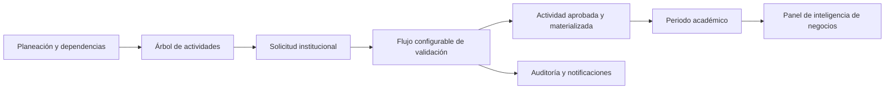

<div align="center">


# RUA

### Registro Unificado de Actividades

**El territorio digital para planear, gestionar y proyectar la Universidad de Santander**

<p>
  <a href="#que-es-rua">Qué es</a> ·
  <a href="#como-funciona">Cómo funciona</a> ·
  <a href="#replicar-el-proyecto">Replicar el proyecto</a> ·
  <a href="#instalacion-local">Instalación</a>
</p>


</div>

> **RUA no es solamente un sistema de métricas.** Es el lugar común donde la
> comunidad universitaria registra sus actividades, sigue sus solicitudes y
> convierte los datos institucionales en decisiones.

## El origen de RUA

RUA significa **Registro Unificado de Actividades**. Además, en el contexto
conceptual que inspira este proyecto, **Rúa**, de origen Emberá Chamí, significa
**territorio o tierra**.

Esta coincidencia le da sentido a la plataforma:

- **Territorio digital:** una tierra firme donde se siembran, cultivan y
  cosechan las actividades de facultades y dependencias.
- **Pertenencia:** un espacio compartido en el que estudiantes, docentes,
  administrativos y directivos consolidan el rumbo de la UDES.
- **Terreno para la inteligencia de negocios:** un territorio de datos que
  permite observar el comportamiento institucional, anticipar escenarios y
  optimizar el esfuerzo de la comunidad.

> *"No solo creamos un Registro Unificado de Actividades; creamos RUA, que en
> lengua Emberá significa territorio. Y eso es exactamente este sistema: el
> nuevo territorio digital donde se unifica, se mide y se proyecta el futuro de
> la Universidad de Santander."*

## Qué es RUA

RUA es un portal web de inteligencia de negocios y gestión académica diseñado
para centralizar el ciclo de vida de las actividades institucionales. Conecta
la estructura de planeación con la operación diaria y deja evidencia de cada
decisión.

El producto es resultado del **diseño y la cocreación de la Oficina de
Planeación Institucional de la Universidad de Santander**, con apoyo de
herramientas de inteligencia artificial. La IA acompañó la exploración,
estructuración y desarrollo; las necesidades, reglas de negocio y decisiones
institucionales pertenecen a la Oficina de Planeación y a la comunidad que
utilizará el sistema.

### Para qué lo desarrollamos

RUA nace para resolver problemas frecuentes de la gestión institucional:

- Información de actividades distribuida en archivos, correos y sistemas
  aislados.
- Dificultad para saber en qué estado está una solicitud y quién debe actuar.
- Validaciones dependientes de procesos manuales y poco trazables.
- Reportes que requieren consolidación antes de poder tomar decisiones.
- Riesgo de perder consistencia entre periodos, responsables, permisos y
  estructura académica.

Su propósito es que la Universidad pueda **registrar una vez, validar con
trazabilidad, consultar en contexto y decidir con datos confiables**.

## Cómo funciona



### 1. Se organiza el territorio

Las actividades se modelan como un árbol jerárquico: actividades principales,
directas y de apoyo. La estructura conserva relaciones entre dependencias,
padres e hijos y puede mantenerse desde un editor visual o mediante cargas
masivas de Excel y CSV.

### 2. Se presenta una solicitud

Una dependencia registra lo que necesita crear o modificar. Cada solicitud
recibe un folio, conserva su historial y queda asociada al periodo académico
correspondiente cuando existe uno abierto.

### 3. El flujo decide de forma configurable

La cadena de validación no está fija en el código: un administrador puede
agregar, ordenar o desactivar etapas y asignar los roles responsables. Cada
aprobación desbloquea la siguiente etapa; una denegación cierra el expediente y
conserva la justificación.

La etapa final puede **materializar la actividad aprobada directamente en el
árbol maestro**. Así se evita que una solicitud aparezca aprobada mientras la
actividad todavía espera una creación manual.

### 4. Se mide y se aprende

El panel BI resume solicitudes, estados, prioridades y comportamiento del
periodo. La información nace de una base estructurada, con reglas de
integridad, permisos y bitácora, para que los indicadores puedan convertirse
en insumos de planeación.

## Capacidades principales

| Módulo | Qué permite |
| --- | --- |
| **Panel BI** | Consultar métricas, solicitudes recientes y señales de gestión. |
| **Actividades** | Administrar el árbol institucional, editar ramas y exportar. |
| **Importación masiva** | Validar y aplicar archivos Excel, CSV o datos pegados desde una hoja. |
| **Solicitudes** | Crear, filtrar, revisar y seguir expedientes con folio. |
| **Flujo configurable** | Diseñar etapas, ordenarlas y asignar roles firmantes. |
| **RUA Tracker** | Ver fases, responsables, plazo en días hábiles y línea de tiempo. |
| **Periodos** | Planificar, abrir, poblar y cerrar periodos sin solapamientos. |
| **Usuarios y roles** | Gestionar perfiles, permisos, estado y restablecimiento de contraseñas. |
| **Auditoría** | Registrar automáticamente cambios relevantes y decisiones. |
| **Correo** | Encolar avisos, renderizar plantillas y conservar bitácora de envíos. |
| **Apariencia** | Elegir paletas y modo claro/oscuro con verificación WCAG AA. |

## Principios de diseño

### La trazabilidad es parte del producto

Una decisión no termina al pulsar un botón. RUA registra quién actuó, cuándo,
en qué etapa, con qué justificación y qué cambio produjo.

### La seguridad vive en la base de datos

La aplicación usa **Row Level Security (RLS)** y permisos por capacidad, no por
el nombre visible de un rol. La interfaz oculta acciones no disponibles, pero
la autorización real se valida en PostgreSQL.

### Las operaciones críticas son transaccionales

Firmar una etapa, abrir un periodo o importar una rama son operaciones que deben
completarse completas o no aplicarse. La lógica se concentra en funciones de
base de datos para evitar estados intermedios.

### Los datos deben poder mantenerse

La importación y la exportación comparten formato. El árbol puede salir a una
hoja de cálculo, editarse y volver a entrar con validación del servidor y
política de todo o nada.

### La accesibilidad se verifica

El sistema deriva sus tokens de color desde semillas de paleta y comprueba
contraste para paletas y modos. El color siempre acompaña al texto y las
animaciones respetan `prefers-reduced-motion`.

## Arquitectura técnica

```text
React + TypeScript + Vite
        |
        |  React Query, React Router, Tailwind CSS, Motion
        v
Supabase
  |-- PostgreSQL: esquema, funciones, triggers y RLS
  |-- Auth: identidad y sesiones
  |-- Edge Functions: altas, contraseñas y correo
  `-- Storage/servicios externos según el despliegue
```

### Estructura del repositorio

```text
src/
  components/       Layout y componentes de interfaz reutilizables
  features/         Funcionalidades por dominio
  lib/              Supabase, formatos, estados, color, CSV y Excel
  styles/           Paletas y tokens visuales
  types/            Tipos generados desde la base de datos
supabase/
  migrations/       Esquema versionado y reglas de negocio
  functions/        Edge Functions de usuario y correo
  seed.sql          Datos de demostración para desarrollo
scripts/             Verificación de contraste y generación de tokens
```

## Replicar el proyecto

RUA está preparado para ser una base adaptable, no una caja cerrada. Para
llevarlo a otra universidad se recomienda separar lo que es plataforma de lo
que es configuración institucional.

### Lo que se puede reutilizar

- Arquitectura React + Supabase.
- Modelo de solicitudes, etapas, auditoría y notificaciones.
- Motor de permisos y políticas RLS.
- Árbol jerárquico e importación masiva.
- Tracker de expedientes y panel de métricas.
- Sistema de temas, tokens y validación de contraste.

### Lo que debe parametrizarse

- Nombre, identidad visual y dominio institucional.
- Facultades, dependencias, vicerrectorías y catálogo de actividades.
- Roles, permisos y responsables de cada etapa.
- Tipos de solicitud, estados, prioridades y reglas de plazo.
- Periodos académicos y calendario de días hábiles o festivos.
- Plantillas, remitente y proveedor de correo.
- Indicadores que la institución considera estratégicos.

### Ruta recomendada de réplica

1. **Levantar el mapa institucional:** actores, actividades, responsables,
   aprobaciones, periodos e indicadores.
2. **Definir el vocabulario:** nombres de roles, estados, permisos y etapas.
3. **Configurar el esquema:** adaptar catálogos y datos iniciales en las
   migraciones y `supabase/seed.sql`.
4. **Revisar seguridad:** probar cada capacidad con usuarios reales de prueba;
   nunca confiar solamente en los controles visuales del frontend.
5. **Cargar una muestra:** validar el árbol y el ciclo completo de una
   solicitud antes de migrar toda la operación.
6. **Ajustar indicadores:** confirmar que las métricas responden preguntas de
   planeación y no sólo cuentan registros.
7. **Desplegar y acompañar:** capacitar a administradores, firmantes y
   solicitantes; revisar auditoría y correo durante el piloto.

## Instalación local

### Requisitos

- Node.js `>=20.19`.
- Un proyecto Supabase o Supabase CLI con Docker para desarrollo local.
- Variables `VITE_SUPABASE_URL` y `VITE_SUPABASE_ANON_KEY`.

Crear `.env.local` en la raíz del proyecto:

```dotenv
VITE_SUPABASE_URL=https://<tu-proyecto>.supabase.co
VITE_SUPABASE_ANON_KEY=<anon-key>
```

Después, instalar dependencias e iniciar el entorno:

```bash
npm install
npm run dev
```

La aplicación muestra un error explícito si faltan las variables de Supabase.
Esto evita iniciar una interfaz aparentemente vacía cuando el problema real es
la configuración del entorno.

### Base de datos

Las migraciones de `supabase/migrations/` se aplican en orden. En local:

```bash
npx supabase init
npx supabase start
npx supabase db reset
```

Para un proyecto remoto:

```bash
npx supabase link --project-ref <tu-ref>
npx supabase db push
```

`supabase/seed.sql` contiene únicamente datos de demostración. No debe usarse
como catálogo productivo sin revisar usuarios, roles y actividades.

### Comandos útiles

| Comando | Uso |
| --- | --- |
| `npm run dev` | Servidor de desarrollo en `:5173`. |
| `npm run build` | Compilación de producción en `dist/`. |
| `npm run typecheck` | Verificación de tipos sin emitir archivos. |
| `npm run lint` | Revisión estática con ESLint. |
| `npm run db:types` | Regeneración de tipos desde el esquema local. |
| `npm run check:contraste` | Verificación de contraste WCAG AA. |
| `npm run gen:tokens` | Regeneración de tokens CSS. |

## Despliegue

El frontend puede desplegarse en Vercel u otro proveedor compatible con Vite.
Las variables `VITE_*` deben estar configuradas **antes de compilar**, porque
Vite las incorpora al bundle.

```text
VITE_SUPABASE_URL       = https://<tu-proyecto>.supabase.co
VITE_SUPABASE_ANON_KEY  = <anon-key>
```

El frontend no despliega por sí solo la base de datos ni las Edge Functions:

```bash
npx supabase db push
npx supabase functions deploy crear-usuario
npx supabase functions deploy restablecer-contrasena
npx supabase functions deploy enviar-correo
npx supabase functions deploy probar-correo
```

Cada función es **un solo archivo**, sin carpeta compartida ni imports
relativos: sólo `index.ts` con su dependencia remota. Es duplicación a
propósito. El despliegue desde el panel de Supabase sube un archivo por
función, y un import a cualquier otro archivo del proyecto deja la función sin
arrancar — y no falla de forma visible: deja de responder, que se diagnostica
mucho peor que un error. `enviar-correo` y `probar-correo` comparten un bloque
idéntico de maquetación y envío; al tocar uno hay que copiarlo al otro.

También hay que configurar el dominio desplegado en Supabase Authentication →
URL Configuration para que los enlaces de recuperación no apunten a
`localhost`.

## Seguridad y operación

- La `service_role` sólo se usa en Edge Functions y nunca en el frontend.
- El alta de usuarios valida el token de quien llama y el permiso
  `usuarios.administrar` antes de usar privilegios elevados.
- Nadie puede resolver su propia solicitud ni cambiar sus propios privilegios.
- Las operaciones de borrado ofrecen archivar como primera opción y muestran
  una previsualización de las filas afectadas.
- El correo se encola fuera de la transacción; los fallos pueden reintentarse
  sin revertir una aprobación válida.
- `RESEND_API_KEY` se configura como secreto de Supabase, no en una tabla ni en
  el código del navegador.

## Estado del proyecto

RUA es un producto en evolución, construido para crecer con la operación de la
Universidad de Santander. El repositorio contiene la aplicación web, el
esquema versionado, las funciones de servidor, los datos de demostración y las
herramientas de verificación necesarias para continuar la cocreación.

## Licencia y uso institucional

Antes de reutilizar RUA en otra organización, se deben revisar los acuerdos de
propiedad intelectual, protección de datos, identidad visual y gobierno de la
información aplicables a la Universidad de Santander.

<div align="center">

**RUA · Registro Unificado de Actividades**<br>
*Un territorio común para convertir actividad institucional en dirección.*

</div>
